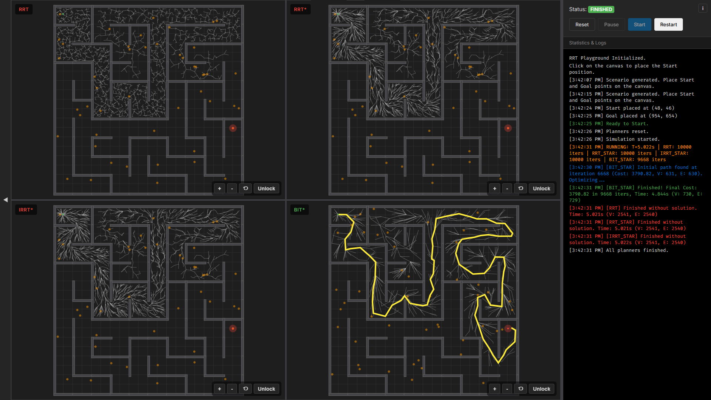

# RRT Playground

This repository provides an interactive web-based visualization of the Rapidly-exploring Random Tree (RRT) algorithm and its optimal variants.

Check out the technical breakdown here:

- [Blog post](#) (coming soon)

Live application: [duy-phamduc68.github.io/RRT-Playground/](https://duy-phamduc68.github.io/RRT-Playground/)

## Visualization Examples

Compare mode showing execution on a procedurally generated maze environment:

Compare mode showing execution on a procedurally generated random forest environment:

## Supported Algorithms

- RRT (Rapidly-exploring Random Tree)
- RRT* (Optimal RRT)
- Informed RRT*
- BIT* (Batch Informed Trees)